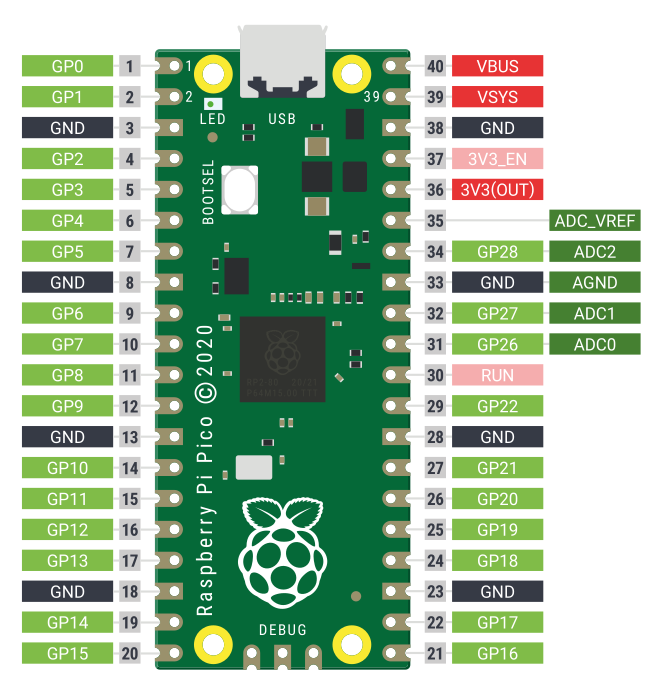
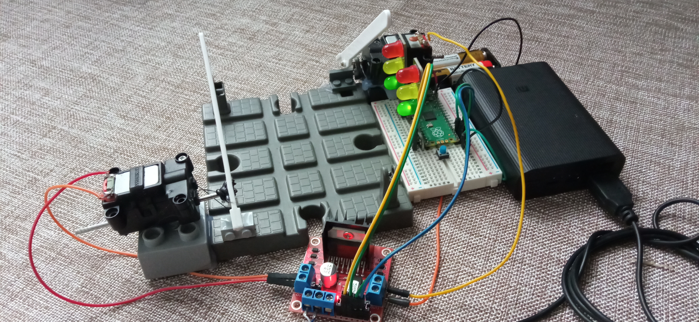
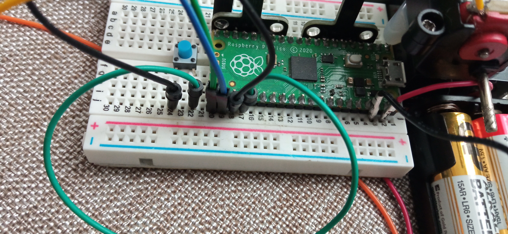
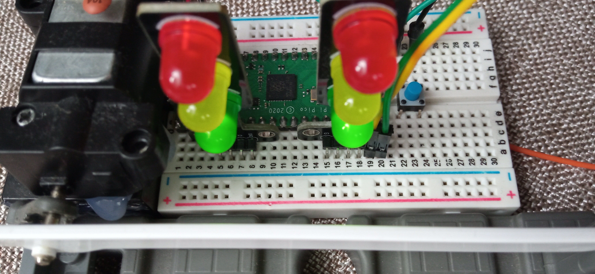

## Проекты на Rasberry Pi Pico 

### Распиновка Rasberry Pi Pico



### Проблемы с подключением Rasberry Pi Pico

Если при подключении Rasberry Pi Pico - устройство не определяется в системе, решить проблему можно созданием нового правила udev. 
Для создания правила плата должна определяться в ситеме, в данном примере плата определена как /dev/ttyACM0.

```
sudo udevadm info --attribute-walk --path=$(udevadm info --query=path --name=/dev/ttyACM0)
```

Создаем новое правило udev /etc/udev/rules.d/rasberry_pi_pico.rules, используя параметры полученные из вывода вышеуказанной команды:

```
KERNEL=="ttyACM0", SUBSYSTEM=="tty", SUBSYSTEMS=="usb", ATTRS{vendor}=="0x1022", ATTRS{product}=="Board in FS mode", GROUP="dialout", MODE="0660"
```

Тестируем правило:

```
udevadm test $(udevadm info -q path -n /dev/ttyACM0) 2>&1
```

Применяем правило:

```
sudo udevadm control --reload-rules
sudo udevadm trigger
```

### Железнодорожный переезд со шлагбаумом

При нажатии на кнопку начинает работать сигнализация (мигают две верхние красные лампы светофора) и опускаются шлагбаумы. Время закрытия переезда 1 минута, после чего перестает работать сигнализация (загораются две зеленые лампы светофора) и поднимаются шлагбаумы.



Для построения проекта потребуются:

```
Rasberry Pi Pico с контактными ножками
Макетная плата
Драйвер L298N для мотора постоянного тока
Тактовая кнопка
Светофоры 
Переезд со шлагбаумом для деревянной железной дороги
Два моторчика с приводами от поломанных машинок с радиоуправлением
Бокс для 2-х пальчиковых батареек для питания Rasberry Pi Pico
Пауэрбанк для питания драйвера L298N
Набор соединительных проводов
USB-кабель для питания драйвера двигателя от пауэрбанка
```

К кнопке подключены бирюзовый провод из гнезда 17 ряда в гнездо 22 ряда, черный провод из гнезда 18 ряда в гнездо 24 ряда.
Драйвер двигателя - синий провод из гнезда 19 ряда подключен в разъем IN4 драйвера двигателя, зеленый провод из гнезда 20 ряда подключен в разъем IN3 драйвера двигателя.
Бокс для 2-х пальчиковых батареек подключен в гнездо 2 ряда красный провод (питание), в гнездо 3 ряда черный провод (земля). 



В гнезда 5, 6, 7, 8 рядов и 15, 16, 17, 18 установлены светофоры.
Драйвер двигателя - желтый провод из гнезда 19 ряда подключен в разъем IN1 драйвера двигателя, зеленый провод из гнезда 20 ряда подключен в разъем IN2 драйвера двигателя.



